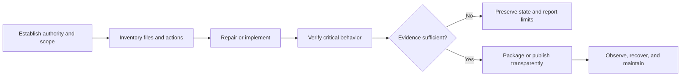

# Reliable Project Delivery Framework

**Public edition:** v1.7.0  
**Source baseline:** ChatGPT New Thread Project Parameters v2.17.13  
**Status:** Current public principles  
**Owner:** Gateway Information Group LLC

This framework describes the shared delivery principles used across my software,
automation, analytics, game, documentation, trading, mining, and diagnostic
projects. It is the public counterpart to a more detailed private operating
package. The public edition preserves the reusable engineering model while
excluding private prompts, account-level instructions, storage topology,
computer profiles, credentials, live settings, and project-specific operating
data.

## How to use this framework

Use the framework when planning, reviewing, repairing, packaging, or publishing
a project. Apply only the controls that fit the project's risk and purpose; a
small read-only utility should remain simple, while software that loads
credentials or performs live financial, administrative, security, or hardware
actions needs stronger gates.

The companion [implementation checklist](PROJECT_FRAMEWORK_CHECKLIST.md) turns
these principles into a practical review sequence. Version history is recorded
in [the changelog](PROJECT_FRAMEWORK_CHANGELOG.md), and the public asset contract
is in [metadata](PROJECT_FRAMEWORK_METADATA.json).

## 1. Evidence and instruction order

Project decisions follow an explicit evidence hierarchy:

1. Safety, legal, privacy, platform, and tool requirements, followed by the
   latest direct user instruction.
2. Current uploads, logs, exact errors, runtime behavior, and reproducible local
   evidence.
3. Current official documentation or status for facts that can change.
4. The newest verified package, manifest, changelog, and confirmed known-good
   state.
5. Preferences and convenience defaults.

Conflicts are stated rather than guessed through. A newer filename or visible
version label does not outrank stronger package, runtime, or acceptance evidence.

## 2. Scope, triage, and coverage

Complex work is triaged as **Critical**, **High**, **Normal**, or **Optional**.
Security, credential exposure, data loss or corruption, destructive or live
financial risk, startup failure, and source ambiguity come first.

Broad requests—such as reviewing every file, project, repository, build, or
Drive item—use a coverage ledger. The ledger records what was reviewed, changed,
preserved, deferred, blocked, not found, or left unresolved. Finalization time
is reserved for saving, packaging, high-value checks, rollback evidence, and an
honest completion report.

## 3. One canonical identity and a lean file-and-action surface

Each project keeps one canonical human-facing name, one stable execution
namespace, and one primary entrypoint. Versions and build identifiers belong in
metadata and release records rather than everyday launcher names. Historical
names remain aliases only when they serve a current, documented need.

A deep cleanup or lean-release review starts with one reconciled inventory of
every retained file and action. The inventory records relative path, type, size
or hash, purpose, producer and consumer, references, lifecycle, lineage, and
ownership.

- Exact duplicates are grouped by content hash.
- Functional overlap is evaluated by behavior, inputs, outputs, side effects,
  and references—not filename similarity alone.
- Each needed capability keeps one active implementation.
- Each user action keeps one BAT/CMD filename and one authoritative backend.
- The action registry records the action ID, backend, arguments or environment,
  outputs, risk, current consumers, and approved aliases.
- Menu, command-line, shortcut, and automation routes call the canonical action
  instead of copying its logic.
- A compatibility alias requires evidence of a current shortcut, task,
  integration, dependency-bound name, signed-history boundary, or explicit user
  requirement. Historical existence alone is not sufficient.
- Approved aliases are logic-free forwarders whose target, argument forwarding,
  and exit code are tested.
- Self-test fails when an unexpected duplicate action launcher or retired action
  route returns to the active package.

Unique data or behavior, meaningful privilege or risk boundaries, different
modes or outputs, platform or format needs, failure isolation, third-party
requirements, signed or checksum-verified artifacts, rollback evidence, and
user-owned files remain separate when justified.

Before a file or route is merged, archived, or retired, code imports and calls,
launchers, shortcuts, scheduled tasks, automation, configuration schemas,
documentation, tests, and output consumers are mapped. Unknown or user-created
files are never silently deleted. The final ledger reports actions, exceptions,
unresolved references, count and size changes, verification, and rollback.

## 4. Project-local and portable operation

Projects derive their working root from the launcher or source location rather
than from the caller's working directory, Desktop, Downloads, or a hard-coded
user path. Configuration, logs, state, temporary files, exports, diagnostics,
reports, downloads, and backups remain project-local by default.

External output is explicit, validated, visible to the operator, and reported.
For Windows utilities, a ZIP-first, root-relative, space-safe package with an
unversioned stable launcher is preferred. Setup and repair paths should be
idempotent and preserve user data.

Cloud storage is a source, handoff, and archive layer—not a live runtime root.
A copied or moved installation should continue independently or provide a clear,
safe repair path.

## 5. Preserve known-good behavior and keep changes reversible

A confirmed working release is retained before significant change. Repair comes
before redesign, and new features do not silently replace working behavior.
Dependency, runtime, API, or platform changes are deliberate and project-tested.

Destructive actions, administrator or security changes, public publication,
bulk writes, credential handling, and live financial activity require an
explicit boundary plus a backup, simulation, or confirmation appropriate to the
risk. Important writes use temporary staging, validation, and atomic
finalization when practical.

Recovery is designed before failure: preserve state, avoid partial publication,
make the first recovery step clear, and keep rollback evidence easy to locate.

## 6. Critical input assurance

A critical input is supported only after it is:

**recognized → validated → mapped → exercised → confirmed**

This applies to symbols, amounts, limits, modes, account or region identifiers,
addresses, paths, devices, models, endpoints, output destinations, and other
values that materially change behavior. Ambiguous, ignored, unsupported,
shadowed, or unconfirmed critical inputs fail closed instead of producing a
misleading success state.

## 7. Release identity before sensitive startup

Released software that may load credentials or perform authenticated activity
verifies its running version, build ID, version record, package metadata,
manifest, and every package-managed SHA-256 before sensitive startup.

A mixed, incomplete, modified, or unsupported release does not proceed merely
because its visible version label looks correct. During failure, local read-only
status, logs, diagnostics, repair guidance, and a bounded support export may
remain available. Verification itself does not rewrite the files it is deciding
whether to trust.

## 8. Independent operation across computers

Computer recognition may provide labels, local defaults, separated logs and
exports, diagnostics, user-interface hints, or performance guidance. It does not
block launch, assign ownership, require a handoff, create cross-computer leases
or write fences, force read-only mode, or wait for another computer.

Unknown computers use safe generic defaults. Same-computer duplicate protection
is used only where simultaneous local execution could cause an unsafe duplicate
action.

## 9. Stable and observable operation

Long-running work uses bounded retries, backoff, queue and resource limits,
clear timeouts, graceful shutdown, durable state where needed, and recovery that
gives up safely when success cannot be verified.

The operator can see what the project is doing, which state it is using, where
it is writing, how health is determined, and how to stop or recover it. Logs and
status evidence favor state changes and actionable events over noisy tight-loop
output.

## 10. Security, data, dependencies, and provenance

Projects do not weaken Norton, SmartScreen, operating-system, browser, platform,
or endpoint protections to make a build appear successful. Secrets are not
printed, logged, committed, or included in support archives.

Data is classified as public, project-internal, sensitive, or secret. Collection
and export are minimized accordingly.

Released projects record direct and bundled dependencies in a compact SBOM or
manifest, pin production dependencies when practical, preserve third-party
notices and licenses, and report unknown or unverified components instead of
guessing. Packing, obfuscation, stealth, persistence, and broad security
exclusions are avoided unless the project's legitimate purpose clearly requires
a separately reviewed mechanism.

## 11. Privacy-conscious diagnostics and Export20

Support evidence is bounded, redacted, deterministic, read-only, and reviewable.
An Export20 package contains no more than twenty high-value items. It is staged
in project-local temporary storage on the same volume, integrity-tested, and
atomically finalized.

The exporter serializes previously collected and sanitized evidence; it does not
perform live network or API calls, platform or Drive writes, document crawling,
repairs, migrations, managed-file rehashes, or invasive discovery merely to fill
missing diagnostic fields. Collector failures and omissions are recorded
without silently dropping the minimum recovery evidence.

After immediate safety containment, a terminal Critical failure may trigger an
automatic diagnostic path:

1. Atomically write a minimal crash capsule from bounded evidence already in
   memory or on disk.
2. Attempt one isolated full Export20 only when process state, storage, and the
   shutdown budget remain usable.
3. Preserve the capsule and exact failure reason when full export cannot finish.

The Critical path never prompts, never delays an emergency shutdown, and never
recursively triggers itself. Trigger fingerprints, cooldowns, bounded buffers,
a same-computer exporter lock, and retention limits prevent duplicate or
runaway exports while preserving Critical and known-good evidence.

## 12. Audience-facing copy and technical evidence

Public-facing product and portfolio copy leads with the audience, problem,
outcome, practical value, and truthful evidence. It avoids private prompts,
parameter-ingestion details, tool orchestration, backend strategy, drafting
process, and other internal implementation context unless that detail is
requested or necessary for trust, safety, attribution, or correct use.

Technical evidence remains available in clearly labeled architecture,
verification, release, security, limitation, and recovery sections. Marketing
copy does not invent capabilities, testimonials, results, scarcity, guarantees,
or implementation status, and it does not promote a candidate beyond its
verified evidence. Required disclosures, licenses, third-party attribution, and
material limitations remain visible.

## 13. Program-specific risk controls

Long-running bots, miners, and trading systems add controls appropriate to their
risk.

Trading systems separate dry-run, test, and live modes; validate products and
balances; account for fees, slippage, precision, and exposure; detect inventory
or order-state mismatches; bound loss and order size; reconcile ambiguous writes;
and provide a clear kill switch. Tests never submit silent live orders.

Mining and compute systems verify executable provenance, dependencies, hardware
and runtime compatibility, resource and temperature boundaries, watchdog and
restart budgets, pool or service configuration, and clean support evidence.
They do not publish wallets, private endpoints, tuning values, or security
exceptions as part of a public showcase.

Public editions of credentialed, financial, mining, security, or administrative
projects are sanitized separately from the owner-operated package. A public
version does not inherit private release authority merely by sharing a name.

## 14. Verification and definition of done

Verification covers the useful minimum for the project:

- canonical entrypoint and visible ready signal;
- launch from an unrelated working directory;
- root and effective output locations;
- configuration and critical-input behavior;
- action-registry coverage, one backend per action, and approved alias behavior;
- relevant duplicate-instance handling;
- migration, move, rename, fresh-extract, or repair behavior when applicable;
- sensitive-startup integrity gates when applicable;
- bounded retries, shutdown, state recovery, logs, diagnostics, manual Export20,
  and the Critical crash-capsule/export path where implemented;
- dependency, metadata, license, and public-sanitization checks;
- audience-facing claims against their technical evidence;
- exact artifact or source-tree identity after packaging or publication.

A substantial deliverable is complete only when required checks ran or are
clearly marked not run. Reports distinguish verified work from rushed,
unverified, deferred, blocked, skipped, or not-found work. Untested computers,
platforms, and artifacts are never described as passing.

## 15. Maintenance and change impact

When behavior changes, update only the affected version and package identity,
file or action inventory, manifest, output contract, dependency record,
changelog, runbook, diagnostics, known-good record, transfer notes, tests, and
public metadata.

Each invariant has one authoritative home. Other files reference that source
instead of repeating rules until they drift. New files, menus, commands,
launchers, aliases, and checker stacks require a distinct purpose.
Backward-compatible changes are preferred where they do not preserve unsafe
behavior.

## Public boundary

This public framework is outcome-focused. It does not publish private custom
instructions, account prompts, Drive organization, project IDs, machine
profiles, credentials, live settings, operational strategies, or private
package contents. Project-specific source, acceptance, and release authority
remain in their own repositories and private records.

Copyright © 2026 Gateway Information Group LLC. All rights reserved.

This notice does not create or replace a software license. See [LICENSE.md](LICENSE.md)
and [SECURITY.md](SECURITY.md).
