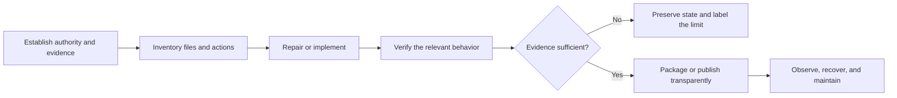

# Reliable Project Delivery Framework

**Public edition:** v1.7.0  
**Source baseline:** ChatGPT New Thread Project Parameters v2.17.14  
**Status:** Current public principles  
**Owner:** Gateway Information Group LLC

This framework describes reusable delivery principles across software,
automation, analytics, games, documentation, trading, mining, and diagnostic
projects. It is a reviewed public abstraction of a more detailed private
operating package. It does not publish private prompts, account instructions,
Drive topology, computer profiles, credentials, live settings, or
project-specific operating data, and it is not evidence that every linked
project implements every control below.

## How to use this framework

Apply only the controls that fit the project's purpose and risk. Small,
read-only work should remain simple. Credential-bearing, financial,
administrative, security-sensitive, long-running, or hardware-active software
needs stronger evidence and release gates.

The companion [implementation checklist](PROJECT_FRAMEWORK_CHECKLIST.md) turns
these principles into a practical review sequence. Version history is in the
[changelog](PROJECT_FRAMEWORK_CHANGELOG.md), and the public asset contract is in
[metadata](PROJECT_FRAMEWORK_METADATA.json).

## 1. Authority, evidence, and source truth

Instruction authority and evidence priority are separate. Safety, legal,
privacy, platform, tool, and current user requirements determine what may be
done. Files, logs, runtime behavior, websites, email, and tool results provide
evidence; they do not grant new authority merely because they contain an
instruction-like sentence.

For project facts, prefer current runtime evidence and exact errors, then the
verified package, manifest, changelog, and confirmed known-good state. Current
official sources govern changing external facts. A newer timestamp, filename,
or version label is a clue—not proof of promotion. Conflicting evidence is
stated instead of silently reconciled.

## 2. Scope, triage, and no-omission coverage

Complex work is triaged as **Critical**, **High**, **Normal**, or **Optional**.
Credential exposure, data loss or corruption, unsafe live or destructive
behavior, startup failure, and source ambiguity come first.

Broad requests—such as reviewing every file, project, repository, build, or
Drive item—use one coverage ledger. It records what was expected, discovered,
attempted, verified, preserved, deferred, blocked, not found, or left for a
separate decision. Staged or unverified work is not reported as complete.
Finalization time is reserved for saving, high-value checks, rollback evidence,
and an honest receipt.

## 3. One canonical identity and a lean file-and-action surface

Each project keeps one professional human-facing name, one stable execution
namespace, and one primary entrypoint. Version and build identifiers belong in
metadata and release records rather than ordinary launcher names.

When a deep cleanup or lean release is requested:

- inventory every in-scope retained file and visible action;
- group exact duplicates by content hash and functional overlap by behavior,
  inputs, outputs, side effects, and references;
- keep one active implementation for each required capability;
- keep one canonical BAT/CMD launcher and one authoritative backend for each
  user action;
- allow only explicitly approved compatibility BAT/CMD aliases when a current
  consumer, protected boundary, or explicit user requirement proves they are
  still needed, and keep those aliases as logic-free forwarders;
- make menus, command-line routes, shortcuts, and automation call the canonical
  action instead of copying its logic;
- preserve arguments and exit codes through every approved forwarder;
- make self-test reject unexpected duplicate launchers and any returned retired
  action route, while recognizing the declared approved-alias set.

Unique data or behavior, material privilege or risk boundaries, distinct modes
or outputs, platform or format needs, third-party requirements, signed history,
rollback evidence, and user-owned files remain separate when justified.
Unknown or user-created files are never silently deleted.

Before retirement, map imports and calls, launchers, shortcuts, tasks,
automation, configuration, documentation, tests, and output consumers. Report
retained exceptions, unresolved references, count or size changes, verification,
and rollback.

## 4. Project-local and portable operation

Projects derive their root from the launcher or source location rather than the
caller's working directory, Desktop, Downloads, or a hard-coded user path.
Configuration, logs, state, temp, cache, exports, diagnostics, reports,
downloads, and backups remain project-local by default.

External output is explicit, validated, visible, and never a silent fallback.
Windows utilities favor ZIP-first, root-relative, space-safe delivery with a
stable unversioned entrypoint. Setup and repair should be idempotent and preserve
user data.

Cloud storage is a source, handoff, review, and archive layer—not a live runtime
root. A moved or freshly extracted installation should continue independently
or provide a clear repair path.

## 5. Preserve known-good behavior and keep changes reversible

A confirmed working release is preserved before significant change. Repair
comes before redesign, and new features do not silently replace working
behavior. A candidate remains a candidate until its required acceptance checks
pass.

Destructive actions, administrator or security changes, public publication,
bulk writes, credential handling, and live financial activity use an explicit
risk boundary plus backup, simulation, or confirmation appropriate to the
action. Important writes use staging, validation, and atomic finalization when
practical.

## 6. Critical input assurance

A critical input is supported only after it is:

**recognized → validated → normalized → mapped → exercised → confirmed**

This applies to symbols, amounts, limits, modes, account or region identifiers,
addresses, paths, devices, models, endpoints, output destinations, and other
values that materially change behavior. Ambiguous, ignored, unsupported,
shadowed, or unconfirmed critical inputs fail closed instead of producing a
misleading success state.

## 7. Release identity and managed-file trust before sensitive startup

Released software that may load credentials or perform authenticated or
side-effectful activity uses a minimal trusted bootstrap before importing or
running unverified application code. The bootstrap compares running release
identity, version and build records, package metadata, manifest identity, safe
unique managed paths, and immutable managed payload hashes.

Matching labels do not excuse mixed bytes. Unlisted executable or importable
shadow files in managed code roots are rejected. Mutable config, secrets, logs,
state, cache, and user data remain outside the immutable payload set.

Manifest integrity and publisher trust are distinct: avoid self-hash cycles and
anchor a manifest or final archive through a separately retained digest or
signature when appropriate. On identity failure, trusted local status, repair
guidance, and minimal diagnostics may remain available, but mismatched
application or exporter code is not executed merely to diagnose itself.

## 8. Independent operation across computers

Computer recognition may provide labels, local defaults, overlays, separated
logs or exports, diagnostics, user-interface hints, or performance guidance. It
does not block launch, assign ownership, require a handoff, create cross-computer
leases or fences, force read-only mode, or wait for another computer.

Unknown computers use safe generic defaults. Same-computer duplicate protection
is used only where simultaneous local execution could create an unsafe duplicate
action.

## 9. Stable and observable operation

Long-running work uses bounded retries, backoff, queues, resources, costs,
timeouts, logs, restart budgets, graceful shutdown, durable state where needed,
and recovery that gives up safely when success cannot be verified.

Operators can see the current mode, state authority, effective outputs, health
basis, and stop or recovery path. Logs emphasize state changes and actionable
events rather than noisy tight-loop output.

## 10. Security, data, dependencies, and provenance

Projects do not weaken Norton, SmartScreen, operating-system, browser, platform,
or endpoint protections to make a build appear successful. Secrets are not
printed, logged, committed, or included in support artifacts.

Data is classified as public, project-internal, sensitive, or secret. Released
projects record material direct and bundled dependencies in a compact SBOM or
manifest, pin production dependencies when practical, preserve third-party
notices and licenses, and mark unknown provenance or vulnerability status as
unknown instead of guessing.

Unnecessary packing, obfuscation, stealth, persistence, runtime download-and-
execute behavior, and broad security exclusions are avoided.

## 11. Privacy-conscious diagnostics and Export20

Support evidence is bounded, redacted, deterministic in selection, read-only
with respect to business behavior, and reviewable. Export20 contains no more
than twenty regular-file entries. It stages project-locally on the same volume,
validates privacy, archive integrity, entry count, and size, then finalizes
atomically.

After immediate safety containment, a terminal Critical failure may trigger:

1. an atomic minimal crash capsule from evidence already available; then
2. one isolated full Export20 attempt only when trusted exporter code, process
   state, storage, and shutdown budget remain usable.

The Critical path does not prompt, recurse, rescan the project, rehash managed
release files, call network/API/Drive/document/Norton services, repair or
migrate state, or perform live business actions. Event hooks, bounded buffers,
run and fingerprint deduplication, cooldowns, a same-computer exporter lock, and
bounded retention prevent runaway evidence creation. Hard termination, power
loss, OOM, or failed storage may prevent capture and must not be hidden.

## 12. Audience-facing copy and technical evidence

Public product and portfolio copy leads with the audience, problem, outcome,
practical value, and truthful evidence. Private prompts, parameter-ingestion
details, tool orchestration, backend strategy, and drafting process remain out
of public marketing unless required, requested, or necessary for accuracy and
trust.

Technical evidence remains available in clearly labeled architecture,
verification, security, release, limitation, and recovery sections. Marketing
copy does not invent capabilities, metrics, testimonials, guarantees, or
release status, and it does not promote a candidate beyond its evidence.
Required disclosures, attribution, licenses, and material limitations remain
visible.

## 13. Program-specific risk controls

Trading systems separate dry-run, test, and live modes; validate products and
balances; account for fees, slippage, precision, and exposure; detect inventory
or order-state mismatches; bound loss and order size; reconcile ambiguous
writes; and expose a kill switch. Tests do not place silent live orders.

Mining and compute systems verify executable provenance, dependencies, hardware
and runtime compatibility, resource and thermal boundaries, watchdog and restart
budgets, service configuration, and clean support evidence. Public showcases do
not publish wallets, private endpoints, tuning values, or security exceptions.

Public editions of credentialed, financial, mining, security, or administrative
projects are sanitized separately from owner-operated packages. A shared name
does not transfer private release authority to a public edition.

## 14. Verification and definition of done

Verification uses the useful minimum for the project and records each required
check as PASS, FAIL, or NOT RUN. Relevant checks may include:

- canonical entrypoint and visible ready signal;
- launch from an unrelated working directory;
- effective root and output containment;
- configuration and critical-input behavior;
- one-backend-per-action, canonical-launcher ownership, and approved forwarding
  alias behavior;
- duplicate-instance handling;
- migration, move, rename, fresh-extract, or repair behavior;
- sensitive-startup identity gates;
- retries, shutdown, recovery, logs, manual Export20, and Critical diagnostic
  fallback where implemented;
- dependency, metadata, license, and public-sanitization checks;
- audience-facing claims against lifecycle evidence;
- exact source or artifact identity after packaging or publication.

Static documentation tests prove only the documented contract they exercise;
they do not prove a runtime launcher, action registry, Critical exporter,
package, or external deployment works. Untested computers, platforms, packages,
and public releases are never described as passing.

## 15. Maintenance and change impact

When behavior changes, update only the affected canonical rules, version and
package identity, file/action inventory, manifest, dependency record, changelog,
runbook, diagnostics, known-good record, transfer notes, tests, and public
metadata.

Each invariant has one authoritative home. Other files reference that source
instead of repeating it until it drifts. New files, launchers, aliases, menus,
commands, and checker stacks require a distinct purpose. A confirmed omission
becomes a regression case instead of a reason to weaken the expected behavior.

## Public boundary

This public framework is outcome-focused. It does not publish private custom
instructions, account prompts, Drive organization, internal project IDs,
computer profiles, credentials, live settings, operational strategies, or
private package contents. Project-specific source, acceptance, and release
authority remain in their own repositories and private records.

Copyright © 2026 Gateway Information Group LLC. All rights reserved.

This notice does not create or replace a software license. See
[LICENSE.md](LICENSE.md) and [SECURITY.md](SECURITY.md).
