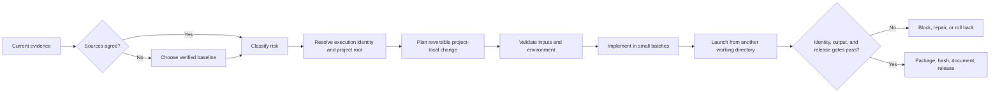

# Reliable Project Delivery Framework

A repeatable control framework for moving complex software projects from uncertain inputs to verified, portable releases while preserving rollback, privacy, operator control, independent local operation, stable launch identity, and project-local outputs.

## Why I built it

Complex projects often fail for ordinary reasons: multiple “final” versions, machine-specific paths, fragile or changing launch filenames, mixed-release folders, outputs written to the caller’s working directory, missing rollback evidence, unbounded diagnostics, unclear responsibility, and changes that cannot be proven safe. I designed this framework to turn those risks into explicit decisions, tests, and release evidence.

## What it does

- Selects a verified working baseline when source packages conflict.
- Keeps one shared package portable across distinct Windows environments.
- Gives each first-party project a case-insensitively unique execution namespace.
- Keeps one stable, unversioned, project-qualified canonical entrypoint while recording versions and build IDs in metadata and release archives.
- Preserves migration aliases or thin wrappers when a backend or historical launcher cannot be renamed safely; duplicated backend logic is not allowed.
- Resolves the project root from the canonical launcher or script location, never from the caller’s current working directory.
- Keeps generated configuration, logs, state, temporary files, caches, exports, diagnostics, reports, downloads, backups, and release evidence under the resolved project root by default.
- Uses project-local temporary files on the same volume before verification and atomic finalization.
- Requires explicit external destinations to be configured, normalized, validated, displayed, and recorded.
- Uses capability detection and optional computer recognition for helpful local labels, paths, defaults, diagnostics, and performance guidance.
- Keeps every installation independently launchable; local process locks and duplicate protection never block another computer.
- Preserves one canonical project name and searchable aliases across releases, handoffs, and project branches.
- Separates reversible local work from destructive, live-financial, credential, administrator, security, public, and bulk-write actions.
- Requires critical inputs to be recognized, validated, mapped, exercised, and confirmed.
- For released software, verifies running release identity and immutable package-managed files before credentials or authenticated startup; a same-version mixed package fails closed.
- Keeps local status, repair guidance, and bounded support evidence available after an identity block without silently rewriting release files.
- Produces bounded, redacted diagnostic packages that retain the most useful evidence.
- Preserves known-good state, rollback instructions, version history, rights metadata, dependency records, and checksums.
- Blocks release when source, validation, execution identity, output containment, runtime identity, or recovery evidence is incomplete.

## Public evidence

The public case study favors evidence a reviewer can inspect directly instead of presenting internal aggregate scores as stand-alone proof.

| Evidence | What a reviewer can verify |
|---|---|
| Source baseline | `MANIFEST.json` and `VALIDATION_SUMMARY.json` identify the reviewed source-framework version and exact package SHA-256 |
| Release inventory | Every published case-study file is declared in `MANIFEST.json` |
| File integrity | Published sizes and SHA-256 values are recorded in `MANIFEST.json` and `SHA256SUMS.txt` |
| Runtime-identity boundary | `VALIDATION_SUMMARY.json` records the software-release gate and marks this documentation-only release not applicable |
| Execution/output boundary | `VALIDATION_SUMMARY.json` records the canonical-entrypoint and project-local-output policy while marking executable implementation project-specific |
| Disclosure boundary | `PUBLIC_SCOPE.md` identifies what is included, withheld, and intentionally not claimed |

The private design baseline was reviewed for coverage, conflict handling, and consistency. Its itemized controls and scenario set are outside the public release, so this case study does not present internal totals as independently auditable results.

## Current operating policy

### Independent local operation across multiple computers

Each installation runs independently. Computer recognition may improve diagnostic labels, choose sensible local paths and defaults, organize local logs, state, and exports, or provide performance guidance. It may not block launch, assign cross-computer ownership, require a remote handoff, create shared leases or write fences, partition features by computer, or control another independently running copy.

Local duplicate protection remains project- and process-scoped on the computer where it runs. A lock or process record created on one computer has no authority over another computer.

### Persistent project, execution, and release identity

Each project keeps one canonical name and one unique execution namespace across successor releases, transfer packages, audits, diagnostics, and release records. Its normal launch filename remains stable, unversioned, and project-qualified. Version, date, and build identifiers belong in `VERSION.txt`, package metadata, manifests, diagnostics, and archive names—not in the filename people or automation use to launch the project.

A deliberate rename keeps a migration map, a forwarding alias or wrapper where practical, and a deprecation plan. The wrapper delegates to the canonical backend and does not duplicate business logic.

### Canonical project root and project-local outputs

The canonical launcher or executable resolves `project_root` from its own location. Calling the launcher from another working directory must not redirect configuration, logs, state, temporary files, caches, exports, diagnostics, reports, downloads, backups, or release evidence into that caller directory, the Desktop, Downloads, a shared system temporary directory, another project, or a hard-coded user path.

Runtime-owned paths default beneath `project_root`. Temporary writes remain on the same volume, are verified, and are atomically finalized where practical. A user-selected external destination is allowed only when it is explicit, normalized, validated, shown to the operator, and recorded in logs or diagnostics. Existing external data is never silently moved or deleted during migration.

### Runtime release identity before authenticated startup

Released software establishes its local root and logging first, then performs a read-only identity check before credentials or authenticated startup. The running version and build must agree with the package control metadata, and every immutable file declared as package-managed must be present and SHA-256 correct. Duplicate, absolute, escaping, out-of-root, missing, size-mismatched, or hash-mismatched managed paths block authenticated or live startup even when the visible version labels match.

Canonical launcher and execution-identity files are part of the immutable release inventory when the project is executable. Mutable configuration, secrets, logs, state, caches, exports, and user data remain outside the immutable release set. A blocked package may still expose local status, repair guidance, and redacted support evidence, but verification does not silently repair or rewrite the package. Documentation-only releases such as this case study mark the runtime gate not applicable rather than adding empty software control files.

## Decision flow

## Design choices

### Source and version control

Conflicting files are resolved through manifests, checksums, known-good records, and explicit lineage. Older artifacts remain historical until deliberately restored.

### Stable automation surface

Automation points to the canonical unversioned launcher, not a dated or versioned filename. Project-qualified helper names prevent unrelated projects from colliding when their folders are placed together or indexed by automation.

### Portability without code drift

One shared package adapts through runtime capability detection and small machine-local overlays. Configuration, logs, state, diagnostics, and temporary files stay local to each installation. Computer identity is descriptive and advisory, never a remote ownership or launch-control mechanism.

### Safe execution

Low-risk local work remains easy to run. High-impact changes require an explicit boundary, a reversible plan, and evidence that the requested input reached the intended behavior.

### Stability and recovery

The framework favors bounded retries, backoff, atomic writes, graceful shutdown, state recovery, local duplicate protection where needed, and a clear first recovery step.

### Verifiable releases

A release is not complete until the source, canonical entrypoint, output roots, running/package identity when applicable, version, documentation, checks, rights, dependencies, diagnostics, rollback path, and final artifact agree. For executable projects, smoke tests include launching from a different working directory and proving that generated outputs remain project-local.

## Skills demonstrated

- Information governance and source reconciliation
- Systems analysis and risk classification
- Release engineering and configuration management
- Canonical entrypoint and execution-namespace governance
- Project-root and output-containment design
- Runtime identity and mixed-release integrity control
- Quality assurance and scenario-based testing
- Windows portability and environment-aware design
- Multi-computer portability without cross-computer restrictions
- Observability, diagnostics, and recovery planning
- Privacy-by-design and controlled public disclosure
- Clear technical communication across complex project states

## Public scope

This case study contains no executable program and does not publish the complete implementation playbook. Machine profiles, raw reports, unique identifiers, credentials, account information, private locations, internal operating instructions, project-specific authenticated endpoints, and live thresholds remain excluded.

See [PUBLIC_SCOPE.md](PUBLIC_SCOPE.md) for the disclosure boundary and [VALIDATION_SUMMARY.json](VALIDATION_SUMMARY.json) for the machine-readable verification scope.

## Release files

| File | Purpose |
|---|---|
| [README.md](README.md) | Case study and design summary |
| [PUBLIC_SCOPE.md](PUBLIC_SCOPE.md) | Public disclosure boundary |
| [VALIDATION_SUMMARY.json](VALIDATION_SUMMARY.json) | Structured validation scope and limits |
| [RIGHTS.md](RIGHTS.md) | Rights and reuse terms |
| [MANIFEST.json](MANIFEST.json) | Canonical release inventory and metadata |
| [SHA256SUMS.txt](SHA256SUMS.txt) | File-integrity records |

Copyright © 2026 Gateway Information Group LLC. All rights reserved.

This notice does not create or replace a software license. No software is distributed in this case study.
