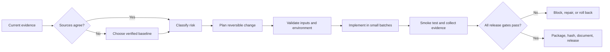

# Reliable Project Delivery Framework

A repeatable control framework for moving complex software projects from uncertain inputs to verified, portable releases without sacrificing rollback, privacy, or operator control.

## Why I built it

Complex projects often fail for ordinary reasons: multiple “final” versions, machine-specific paths, fragile launchers, missing rollback evidence, unbounded diagnostics, unclear ownership, and changes that cannot be proven safe. I designed this framework to turn those risks into explicit decisions, tests, and release evidence.

## What it does

- Selects a verified working baseline when source packages conflict.
- Keeps one shared package portable across distinct Windows environments.
- Uses capability detection and local overlays instead of machine-specific code forks.
- Separates reversible local work from destructive, live-financial, credential, administrator, security, public, and bulk-write actions.
- Requires critical inputs to be recognized, validated, mapped, exercised, and confirmed.
- Produces bounded, redacted diagnostic packages that preserve the most useful evidence.
- Preserves known-good state, rollback instructions, version history, rights metadata, dependency records, and checksums.
- Blocks release when source, validation, ownership, or recovery evidence is incomplete.

## Validation scorecard

| Measure | Result |
|---|---:|
| Release package | 15 files; ZIP integrity passed |
| Control areas represented | **24 / 24** |
| Scenario simulations passed | **35 / 35** |
| Negative-conflict checks passed | **16 / 16** |
| Privacy boundary | Raw machine reports and unique identifiers excluded |

The validation confirms internal consistency and expected decision paths in the v2.17.0 framework package. It does not replace project-specific testing or guarantee future system behavior.

## Decision flow

## Design choices

### Source and version control

Conflicting files are resolved through manifests, checksums, known-good records, and explicit lineage. Older artifacts remain historical until deliberately restored.

### Portability without code drift

One shared package adapts through runtime capability detection and small machine-local overlays. Configuration, logs, state, diagnostics, and temporary files stay local to each installation.

### Safe execution

Low-risk local work remains easy to run. High-impact changes require an explicit boundary, a reversible plan, and evidence that the requested input reached the intended behavior.

### Stability and recovery

The framework favors bounded retries, backoff, atomic writes, graceful shutdown, state recovery, owner locks where duplicates are unsafe, and a clear first recovery step.

### Verifiable releases

A release is not complete until the source, version, documentation, checks, rights, dependencies, diagnostics, rollback path, and final artifact agree.

## Skills demonstrated

- Information governance and source reconciliation
- Systems analysis and risk classification
- Release engineering and configuration management
- Quality assurance and scenario-based testing
- Windows portability and environment-aware design
- Observability, diagnostics, and recovery planning
- Privacy-by-design and controlled public disclosure
- Clear technical communication across complex project states

## Public scope

This case study contains no executable program and does not publish the full operating framework. Machine profiles, raw reports, unique identifiers, credentials, account information, private locations, internal operating instructions, and project-specific live thresholds remain excluded.

See [PUBLIC_SCOPE.md](PUBLIC_SCOPE.md) for the disclosure boundary and [VALIDATION_SUMMARY.json](VALIDATION_SUMMARY.json) for the machine-readable scorecard.

## Release files

| File | Purpose |
|---|---|
| [README.md](README.md) | Case study and design summary |
| [PUBLIC_SCOPE.md](PUBLIC_SCOPE.md) | Public disclosure boundary |
| [VALIDATION_SUMMARY.json](VALIDATION_SUMMARY.json) | Structured validation results and limits |
| [RIGHTS.md](RIGHTS.md) | Rights and reuse terms |
| [MANIFEST.json](MANIFEST.json) | Canonical release inventory and metadata |
| [SHA256SUMS.txt](SHA256SUMS.txt) | File-integrity records |

Copyright © 2026 Gateway Information Group LLC. All rights reserved.

This notice does not create or replace a software license. No software is distributed in this case study.
