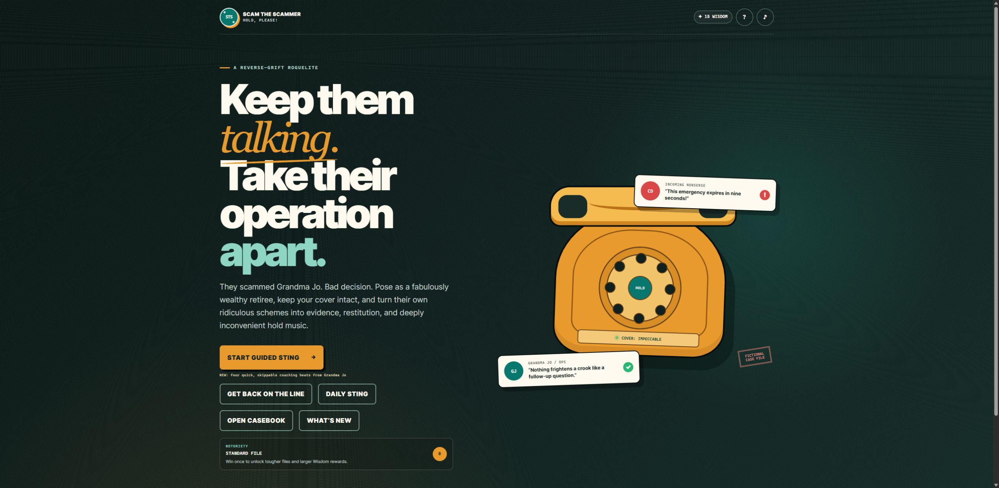

# Scam the Scammer: Hold, Please!

**Make complex choices understandable, consequential, and worth replaying.**

Scam the Scammer: Hold, Please! is a turn-based comedy card roguelite about outwitting fictional fraud crews. Players read caller tells, choose cover tactics, manage suspicion, and build a case through escalating encounters.

**[Play the free browser game](https://zappytap.itch.io/scam-the-scammer-hold-please)** · Public test, version 0.13.3 · Proprietary source

## What makes the experience distinctive

- **Decisions with visible consequences.** Caller tells, rival scripts, and an optional explanation drawer help players understand a choice before committing. The challenge comes from weighing trade-offs, with time to read and plan.
- **Connected mechanics and storytelling.** Evidence Chains reward a sequence of clean reads. Hold Queue interruptions introduce delayed consequences, connecting a tactical choice to the conversation that follows.
- **Replay that supports learning.** Seeded challenges and shareable case codes make encounters repeatable. Local debriefs and a Casebook help players reflect on how a run unfolded.
- **Recovery built into the experience.** Local progression, validated backup imports, and visible storage status make returning to a run part of the product design. Keyboard controls can be remapped, coaching is optional, and audio can be muted.

## Capabilities demonstrated

The game brings together interaction design, stateful application behavior, narrative systems, explainable choices, and recovery-focused usability. The playable release lets a reviewer experience how those decisions work together.

## Availability and evidence

The public game and its version display were checked on September 9, 2026. The retained 0.13.3 release archive passed a fresh integrity check. This review did not repeat the complete gameplay suite; physical-phone and formal assistive-technology coverage remain incomplete. No adoption, revenue, or measured learning-effectiveness claims are made.

All crews and events are fictional. The game is entertainment, not guidance for contacting or retaliating against real scammers. The linked release includes its applicable credits and disclosures.

[Return to projects](../README.md#games-and-interactive-projects)

Copyright © 2026 Gateway Information Group LLC. All rights reserved.
