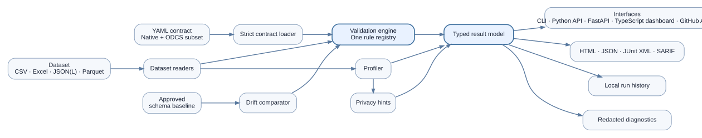

# Data Contract Monitor

**Executable data contracts for files, pipelines, and review workflows.**

Data Contract Monitor catches broken schemas, stale records, invalid values, duplicate keys, and unreviewed sensitive fields before unreliable data reaches a report, model, or operational process. It turns readable YAML expectations into evidence that people can review and automated workflows can enforce.

[Explore the source](https://github.com/Jnapier2/data-contract-monitor) · [Download v0.1.5](https://github.com/Jnapier2/data-contract-monitor/releases/tag/v0.1.5) · [Try the included demos](https://github.com/Jnapier2/data-contract-monitor#try-the-included-demos)

The passing and failing demos use synthetic data and need no credentials. On Windows, extract the release ZIP and open `START_DATA_CONTRACT_MONITOR.bat`. Standard 64-bit Python 3.11–3.14 is required; the first launch needs internet access to install dependencies.

## Product status

| Item | Publicly supported statement |
| --- | --- |
| Program version | 0.1.5 — public alpha |
| Build | `DCM-0.1.5-B20260828-ACTION2` |
| Verification | 75 automated tests passed from a fresh release extraction; all 124 managed-file hashes matched |
| Review experience | Local dashboard, passing and failing demos, severity filters, and downloadable evidence |
| Source rights | Apache-2.0; source and release download are public |

The release includes exact-artifact verification receipts and known limitations. Earlier v0.1.2 synthetic benchmark evidence remains available separately: a 100,000-row, six-column CSV completed with a 0.475-second packaged median and a 0.589-second independent rerun median. These are historical local measurements, not v0.1.5 performance claims or production service-level promises. Hardware, storage, format, and rule complexity affect results. See [the benchmark evidence](evidence/data-contract-monitor-benchmark-review.json).

## The problem

A dataset can remain technically readable while becoming operationally unsafe. A required column can disappear, a business key can duplicate, yesterday's feed can become stale, or an unapproved sensitive field can arrive without causing a parser error.

Data Contract Monitor makes those failures explicit and reviewable. A clean run and a failed run use the same engine, result model, severity rules, and report formats.

## Review workflow

1. Select or generate a readable YAML contract.
2. Validate a CSV, Excel, JSON, JSON Lines, or optional Parquet dataset.
3. Review failures by severity, rule, column, and affected-row count.
4. Inspect aggregate column profiles and privacy-field hints without exposing raw cell values in the report.
5. Export structured evidence for people, continuous integration, and security-review workflows.
6. Compare new schemas with an approved baseline to detect added, removed, type-changed, or nullability-changed fields.

## Architecture

One validation engine and one typed result model serve every interface. This prevents the dashboard, command line, API, Python package, and automation integration from developing different meanings for the same rule.

## Capabilities

| Capability | Practical value |
| --- | --- |
| Executable contracts | Required fields, types, nullability, uniqueness, ranges, lengths, patterns, approved values, and freshness become version-controlled checks |
| Dataset-level controls | Row-count ranges, composite uniqueness, null-ratio limits, and conditional completeness cover rules that cannot be expressed one column at a time |
| Drift monitoring | Approved schema baselines expose additions, removals, type changes, and observed-nullability changes |
| Privacy review | Heuristic field-name and bounded sample-pattern signals guide human review without claiming to be a data-loss-prevention product |
| Multiple evidence formats | Accessible HTML, JSON, JUnit XML, and SARIF support business review, automation, and code-scanning workflows |
| Shared interfaces | The command line, local API, dashboard, Python package, and composite action use the same validation semantics |
| Local-first operation | Temporary uploads are removed after each request; reports contain aggregate evidence rather than raw dataset values |

## Reliability design

- Release-mode startup verifies the version, build metadata, manifest, and every managed-file digest before normal execution.
- The Windows launcher derives the project root from its own location and keeps mutable outputs project-local.
- A preferred-port collision selects another reserved loopback endpoint instead of opening an unrelated local service.
- The browser opens only after the health response proves the exact service, version, build, and per-launch identity.
- Data-quality failure uses a different exit code from execution failure, allowing automation to distinguish bad data from a broken tool.
- Critical failures produce bounded, redacted local evidence rather than recursively copying the project.
- Recovery starts from a clean extraction of the known package instead of mixing managed files from different versions.

## Demonstrated scenario

The synthetic customer-order example includes a passing dataset and a deliberately broken dataset. The failed case produces twelve findings across schema, completeness, uniqueness, validity, freshness, and privacy review. The passing case produces none. No credentials or private records are required.

## What this demonstrates

- Translating business expectations into enforceable data rules.
- Designing evidence that serves both technical and nontechnical reviewers.
- Separating data failure from software failure.
- Building local-first software with explicit release integrity and recovery behavior.
- Connecting data quality, privacy review, schema governance, automation, and accessible reporting.

## Public boundary

This case study contains no private release archive, support export, user path, machine identifier, private package digest, account information, credential, or production dataset. It does not expose raw evidence from the private Windows acceptance run.

## Limitations

- The current engine is file-oriented and loads a dataset into memory; it is not a distributed or streaming validator.
- Privacy detection is heuristic and requires human review.
- Optional formats require their corresponding dependencies.
- First-run dependency installation may contact the configured package index.
- This is alpha software, not a production service guarantee. Review the [release evidence and limitations](https://github.com/Jnapier2/data-contract-monitor/releases/tag/v0.1.5) before using important data.

Copyright © 2026 Gateway Information Group LLC. All rights reserved.
