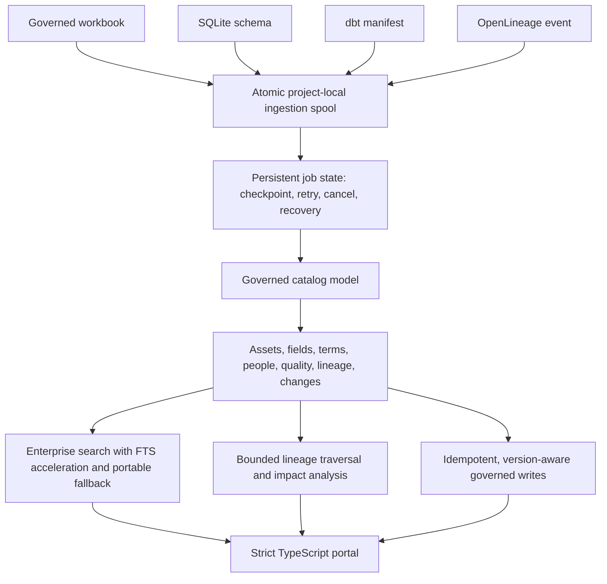

# Data Governance & Lineage Portal

**A governed catalog that connects meaning, ownership, trust, technical lineage, and controlled change.**

Data Governance & Lineage Portal helps people answer three practical questions:

1. What does this data mean, and who is accountable for it?
2. What evidence supports trusting it?
3. What sources, reports, fields, and processes are affected when it changes?

The experience brings business definitions, owners, stewards, field metadata, classifications, retention, quality controls, certification, lineage, impact analysis, and change review into one local-first demonstration.

## Product status

| Item | Publicly supported statement |
| --- | --- |
| Maintenance version | 0.2.1 |
| Build | `DGPLP-0.2.1-20260828-FIELDHARDEN1` |
| Current evidence class | Verified maintenance baseline with 53 automated tests, strict TypeScript build, Python compilation, and release identity across 126 managed files |
| Field rollback | Version 0.2.0 remains the field-confirmed Windows rollback baseline |
| Windows boundary | The version 0.2.1 BAT was not physically executed in the independent review environment; direct Windows field evidence applies to version 0.2.0 |
| Source rights | Proprietary first-party source; public case study only |

## The product

A user can begin with a governed business concept such as **Active Customers** and see its definition, accountable owner and steward, source systems, source fields, transformation logic, quality evidence, refresh cadence, consuming reports, recent changes, and downstream impact.

A proposed definition update enters a permission-aware review workflow rather than silently changing the metric. The same governed model also supports catalog discovery, technical field inspection, certification evidence, backup and restore, migration status, and persistent ingestion jobs.

## Supported metadata inputs

- A governed spreadsheet template.
- SQLite schema metadata without reading business rows.
- dbt manifest artifacts.
- OpenLineage events.

Uploads are atomically staged in a project-local spool before processing. Import transactions remain atomic, so a failed job cannot leave a half-written catalog.

## Architecture

## Governance capabilities

| Capability | Practical value |
| --- | --- |
| Catalog and glossary | Business terms, technical assets, fields, domains, owners, stewards, and classifications are discoverable in one model |
| Quality evidence | Controls, results, certification state, and refresh information explain why an asset should or should not be trusted |
| Multi-hop lineage | Source-to-report traversal connects systems, assets, fields, transformations, and evidence sources |
| Impact analysis | Downstream risk is layered over the lineage graph so a proposed change can be evaluated before approval |
| Controlled change | Idempotency keys prevent unsafe duplicate submissions; row versions reject stale approvals instead of overwriting newer metadata |
| Persistent ingestion | Bounded local work records attempts, checkpoints, progress, cancellation, recovery, and the resulting import run |
| Search at scale | Query-bound keyset cursors and FTS acceleration avoid increasingly expensive deep-offset browsing |
| Recovery operations | Versioned migrations, integrity-checked SQLite snapshots, safety backups, restore reconciliation, and schema-preserving demo reset support repeatable recovery |
| Dual presentation | The same governed content supports an interactive local portal and a deterministic static portfolio demonstration |

## Reliability and performance foundation

- Alembic owns the schema lifecycle, including backed-up migration from an earlier catalog.
- SQLite uses explicit durability, timeout, integrity, and runtime-index controls.
- A different release in the same project root is blocked from becoming a second local catalog writer.
- Independent extracted copies remain free to run on separate local ports.
- Release identity is cached at startup and normal write paths fail closed when managed files do not match.
- Doctor and bounded support export remain available without third-party dependencies when the application environment is damaged.
- Background ingestion shares the database maintenance lock; unexpected worker-loop failure records bounded evidence and retries with backoff.
- A deterministic benchmark harness covers 2,000 through 100,000 synthetic assets. The published budgets are regression signals, not cross-machine service-level promises.

## Verification summary

The maintenance source passed:

- 53 automated tests.
- Python compilation.
- Strict TypeScript type checking and production build.
- Release identity verification across 126 managed files.
- Schema-preserving reset and ingestion-worker coordination checks.
- Exact extracted-instance launch identity and same-root cross-release writer protection.
- Runtime lock-version and managed-runtime integrity contracts.
- Deterministic synthetic sample and static-demo generation.

The retained Windows field baseline confirmed healthy release identity, database integrity, schema migration state, expected synthetic catalog counts, and safe fallback-port selection for version 0.2.0. Version 0.2.1 preserves that catalog foundation while strengthening launch attribution, runtime verification, reset safety, and recovery diagnostics.

## What this demonstrates

- Connecting governance policy to operational impact rather than treating governance as documentation alone.
- Designing a shared model for definitions, accountability, quality, lineage, and change.
- Building conflict-safe writes, recoverable ingestion, explicit migrations, and reviewable recovery evidence.
- Explaining enterprise architecture through an accessible local product and synthetic scenario.
- Maintaining a precise distinction between verified source behavior, field-confirmed rollback evidence, and untested deployment boundaries.

## Public boundary

This case study contains no proprietary source code, private release archive, support export, machine or user identifier, private package digest, credential, internal path, Drive reference, or production metadata. All examples are synthetic.

## Limitations

- The role header is a demonstration mechanism, not enterprise authentication.
- The local single-worker design is not a highly available queue architecture.
- PostgreSQL uses the shared model and migration path but was not certified against a live server in the reviewed environment.
- The optional managed Windows runtime binary was not built in the independent review environment.
- Enterprise identity, managed secrets, immutable audit retention, centralized observability, platform-native database backup, and organization-specific policy enforcement remain deployment responsibilities.
- Direct Windows BAT acceptance for version 0.2.1 remains separate from the field-confirmed version 0.2.0 rollback evidence.

Copyright © 2026 Gateway Information Group LLC. All rights reserved.
